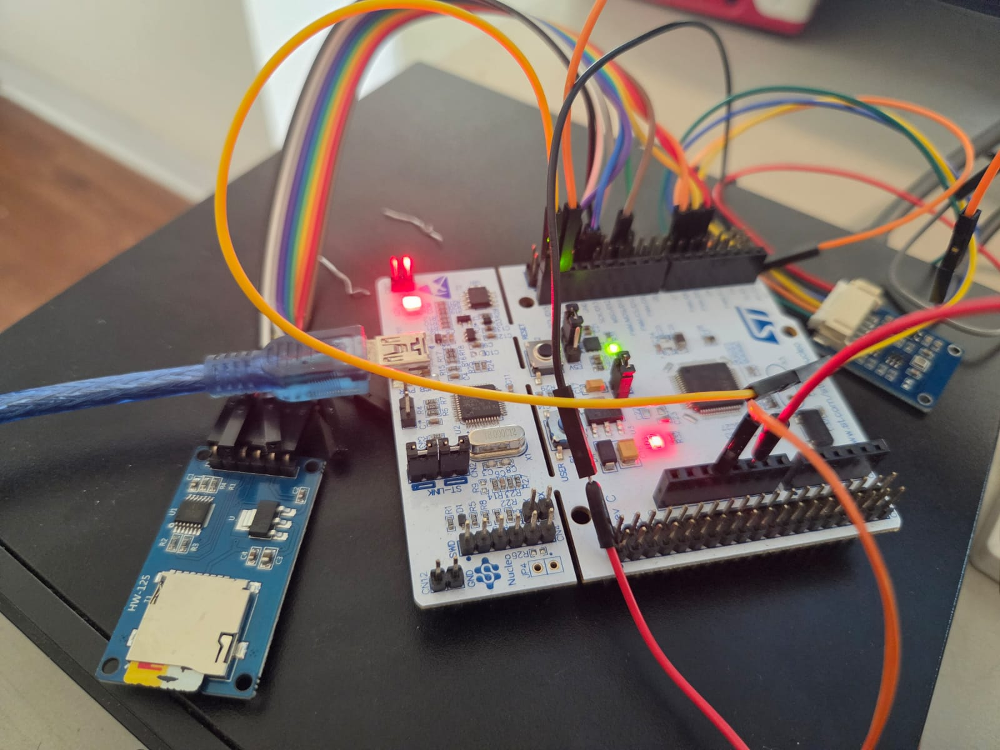
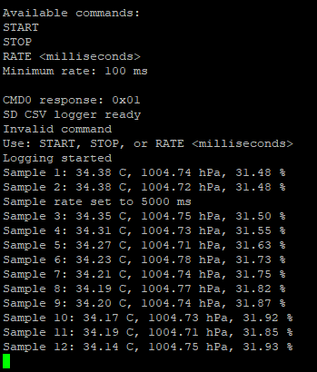

# STM32 FreeRTOS Sensor Data Logger

This is a small embedded project I built using an STM32F446RE and FreeRTOS.

The system reads sensor data using I2C/SPI and uses multiple FreeRTOS tasks, queues, mutexes, and software timers. I also used UART to monitor the data.

For debugging, I used GDB/JTAG, a logic analyzer, oscilloscope, and SEGGER SystemView.

## Tools Used

- C
- STM32F446RE
- FreeRTOS
- I2C, SPI, UART
- STM32CubeIDE
- GDB/JTAG
- Logic Analyzer
- SEGGER SystemView

## Hardware Setup

## Sensor Output

## What I Worked On

I worked on the firmware, sensor communication, FreeRTOS task setup, synchronization, UART output, and debugging the complete system.
